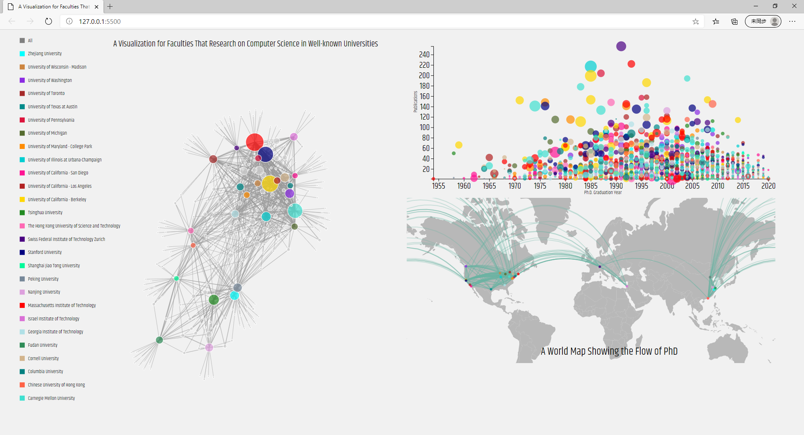
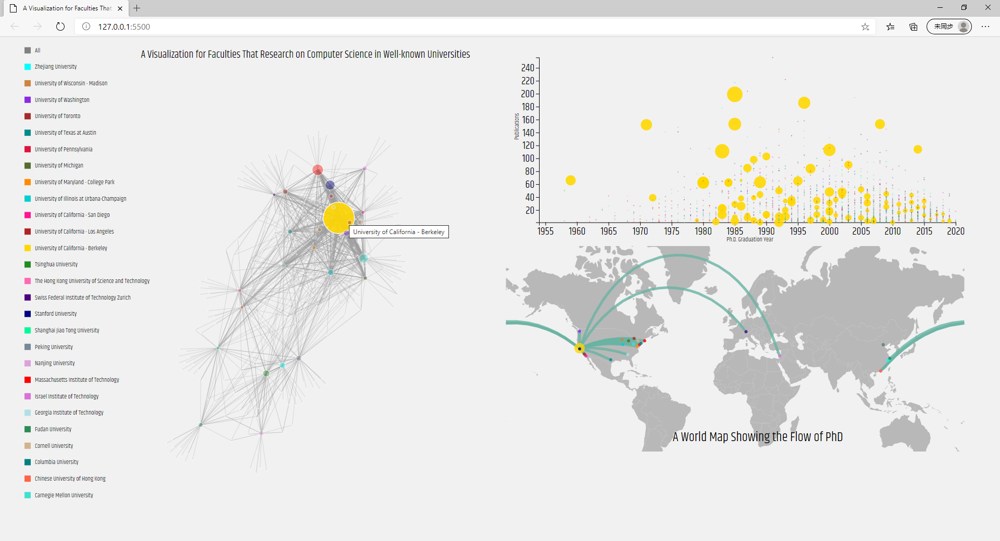
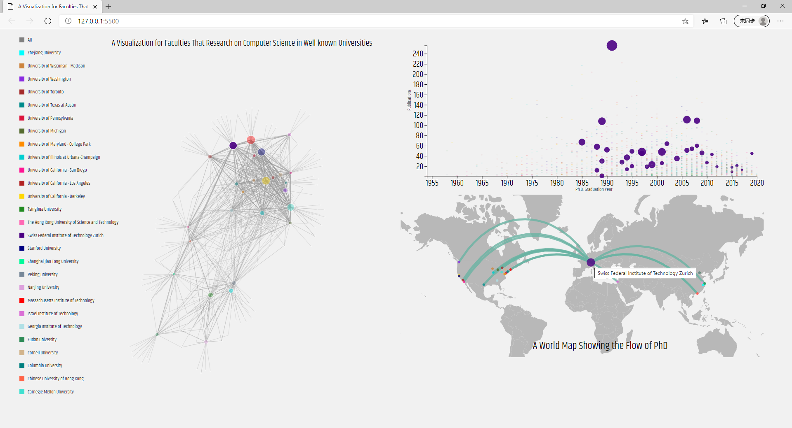
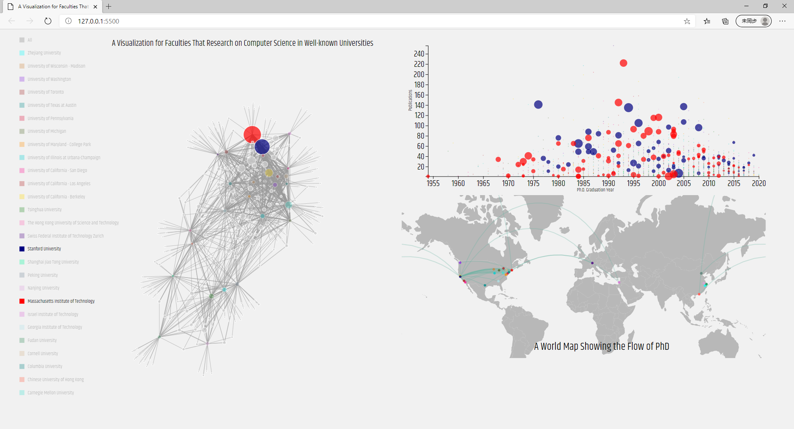

# 作业3 多视图的、可交互的可视分析系统报告
>1800013117 田野 1800013117 黄孝谨

## 1.选择的数据维度

在我们组完成的可视化系统中，实现了三个视图。它们各自的含义和对应的维度为：
1. 力导向图。其中每一个点代表一个学校，每一条线代表了从起点学校通过毕业到达目标学校的流向。线的粗细与该流向的人员数量成正比，点的颜色和大小都在一定程度上代表了该学校的毕业研究员人数多少。
2. 散点图，其中包含的维度和含义有：：用横轴坐标表示的横轴，用纵轴坐标代表的研究员发表的论文数，用数据点的颜色代表的其毕业学校种类，用数据点大小代表其影响力H-index。
3. 地图流向，其中使用的维度有：人员流动个数，人员流动起点，人员流动重点，学校的经纬度。通过这些维度我们希望能够探究这些顶尖的计算机研究者在世界各地上有怎样的地域分布。

## 2.设计的宗旨和目标

希望完成的任务：
1. 通过散点图，简单观察出研究员毕业年份和其发表论文数、影响力三者之间的相互关系。
2. 通过力导向图在给定参数下能够观察出人员在各个学校的流动关系。通过线、点的大小来反映出学校的受欢迎程度。
3. 通过世界地图，观察出人员流动在地域上反应出的信息。希望能够得到和地域有关的计算机大学实力信息，以及通过路径反映出研究员的地理位置变化趋势。
4. 设置一个多选框，用来筛选出需要的学校信息。希望筛选能够同时在三个图中体现出相应的高亮和交互。
5. 能够使得悬停的交互同时应用在三个图上。这样对于一个特定学校的选取，我们能同时看出其研究员水平、人员流动，和地理信息流向关系。

这样设计的优势：
1. 交互简单直接。所有的交互都通过点击、悬停和移走来实现，没有太多的学习成本。
2. 信息量大而全。通过三张图的统一交互来在一次观察中获得更多信息。
3. 只使用三个图，界面整体简洁统一，互相有关联。

这样设计的不足：
1. 仍有一些数据维度可以继续探索，如相关的研究方向等。由于页面大小限制，没有选择加上过多的展示图。
2. 在地图上只集中在了计算机名校上，没有显示出所有的流向机构。
3. 散点图还能够继续扩展，如横纵坐标、范围、提示框等。
4. 还可以加上zoom效果来更具体展示每一个单体图。
5. 交互的方式较为简单，可以加上更复杂多样的交互方式来获取更具有特殊意义的信息。

## 3.可视化结果描述

我们设计的主体展示图如下：

可以看到图的左侧为力导向图，右上方为散点图，右下方为设计的世界地图及人员流向线。

1. 对于力导向图，可以对其中的数据点进行拖动来观察力导向图的变化，在每一个点上悬停2s可以展示出具体的学校名称。
2. 对于散点图，可以对其中某一点悬停，来筛选出所有毕业于该学校的研究员信息。
3. 对于世界地图，悬停在某一点上来观察这所学校的名称及其人员流动地理信息，如图所示
4. 左侧的图标也能够承担多选框的作用。通过单次点击和双次点击，筛选出需要的学校名单，此时会在三个图中同时反映出筛选后的学校、对于的人员、对于的流向关系。
5. 每一个悬停交互都能够同时在三个图中反映出来，也使得信息更加统一和直接。

通过这些交互图，可以发现一些结论：
1. 美国各名校博士毕业后大多会继续在美国的研究机构深造，去国外的相对较少
2. 中国几个名校的博士毕业后基本全部都留在国内的研究机构，Chinese University of Hong Kong相对而言毕业后前往美国的占比更高
3. 其他国家的名校如Swiss Federal Institute of Technology Zurich，博士毕业之后的去向更为丰富。如上述的世界图中所展示的苏黎世大学，可以研究者研究者丰富的未来选择。